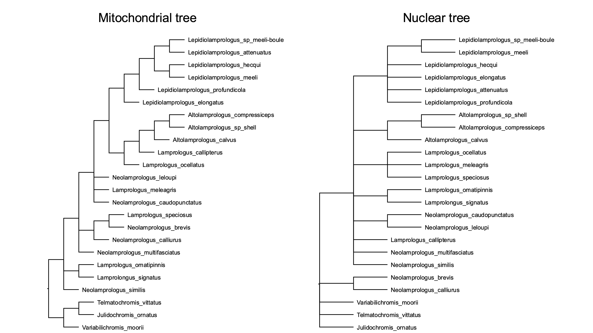

# OLA-Net #

OLA-Net estimates the reticulation number - the number of reticulation events required to explain the topological differences across a set of phylogenetic trees. The trees can be multifurcating - in this case, OLA-Net will resolve them to minimize the topological discrepancy and the reticulation number between the trees. OLA-Net was inspired by the Ordered Leaf Attachment (OLA) vector encoding of phylogenetic trees (see [Richman et al., 2025](https://arxiv.org/abs/2503.10169)) and a direct connection between OLA vectors and acyclic agreement forests (see [Markin et al., 2025](https://arxiv.org/pdf/2509.16405)).

As OLA-vectors depend on a fixed-ordering of leaves/taxa, OLA-Net provides two options to estimate the reticulation number depending on the type of dataset you have:

1. If you are analyzing recombination among RNA viruses, you can specify a metadata file with a collection date for each virus, and OLA-Net will infer the ordering of the leaves from the dates (see [testfiles/generated_dates.csv](testfiles/generated_dates.csv) for an example). We recommend this option for RNA viruses as it will produce fastest and likely most accurate results.

2. If you are analyzing macroevolutionary events, OLA-Net will try many random permutations of taxa to estimate the reticulation number. Below, we show an example of how this can be used.

OLA-Net requires Python 3, and it depends on TreeSwift (`pip install treeswift`) to run.

The tool has built-in options to help you reduce the tree estimation error to achieve better results: it allows you to drop low-support branches and/or branches that are too short.

## Example on Lamprologini fish dataset ##

We use a dataset from [Bernardini et al., Mol Phylogenet Evol., 2023](https://www.sciencedirect.com/science/article/pii/S1055790324001295) to demonstrate the workings of OLA-Net. Note that while we analyze only two trees in this example, OLA-Net can generally analyze any number of trees.

The following 2 multifurcated trees have an optimal reticulation number of **4** as was shown by Bernardini et al.

<center>

</center>

These trees in Newick format are located in [testfiles/Lamprologini.tre](testfiles/Lamprologini.tre). We then run OLA-Net as follows:

```
python olanet.py -t testfiles/Lamprologini.tre -p 1000
```

OLA-Net will generate 1000 random permutations and will find the smallest reticulation number across these permutations. Here is the output from the tool (this example requires around 1 second to run):

```
2 tree(s) loaded successfully from 'testfiles/Lamprologini.tre'.
Found 24 common taxa across all trees.
Collapsing branches with support below 70 and length below 1e-09 (if branch lengths and/or support values are specified in trees)
Tree 1
	Initial # of internal nodes: 19
	After short branches collapsed: 19
	After low-support collapsed: 19
Tree 2
	Initial # of internal nodes: 10
	After short branches collapsed: 10
	After low-support collapsed: 10
Generating 1000 random leaf orderings...
Processing 1000 permutations using 12 cores...

Minimum Estimated Reticulation Number: 4
```

With 1000 permutations, OLA-Net will almost certainly find an optimal ordering and will output the correct reticulation number: 4. For larger trees and/or datasets with more reticulations, trying more permutations can be beneficial.

Make sure to see all options in OLA-Net by running
```
python olanet.py -h
```
